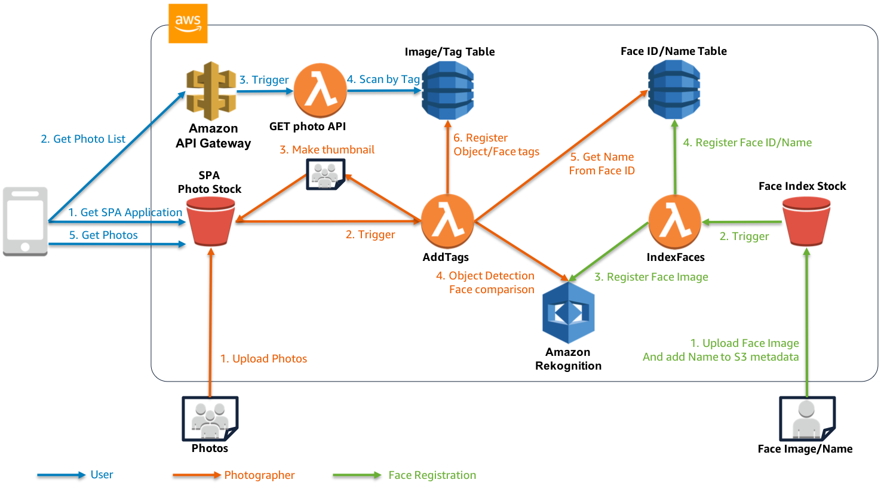

aws-photorekognition
---

Photo album application with Amazon Rekognition.

# Architecture



# Components

- Backend: Amazon Rekognition, Amazon DynamoDB, Amazon S3, AWS Lambda
- API: Amazon API Gateway, AWS Lambda
- Frontend: Amazon S3 (Web Hosting), Vue.js


# Usage

## Preparation

- Set up AWS CLI for your environment and set credentials.

## Launch Backend

```bash
$ cd backend
```

- set variables in `deploy.sh`

```bash
STACK_NAME=PhotoManagerBackend
TEMPLATE_BUCKET=s3://{YOUR_TEMPLATE_BUCKET_NAME}
PREFIX={SET_UNIQUE_PREFIX} # you can use lower case alphabet only.
```

- launch

```bash
$ ./deploy.sh
```

## Launch API

```bash
cd api
```

- set variables in `deploy.sh`

```bash
STACK_NAME=PhotoManagerAPI
LAMBDA_DIR=photomanager_lambda
PREFIX={SET_UNIQUE_PREFIX_SAME_AS_BACKEND} # you can use lower case alphabet only.
```

- launch

```bash
$ ./deploy.sh
```

## Copy Vue.js application to S3 bucket

- set variables in `deploy.sh`

```bash
BUCKET_NAME={SET_UNIQUE_PREFIX_SAME_AS_BACKEND}photos
```

- launch

```bash
$ ./deploy.sh
```

# Demo Page

https://photomanager.miyamoto.cloud

